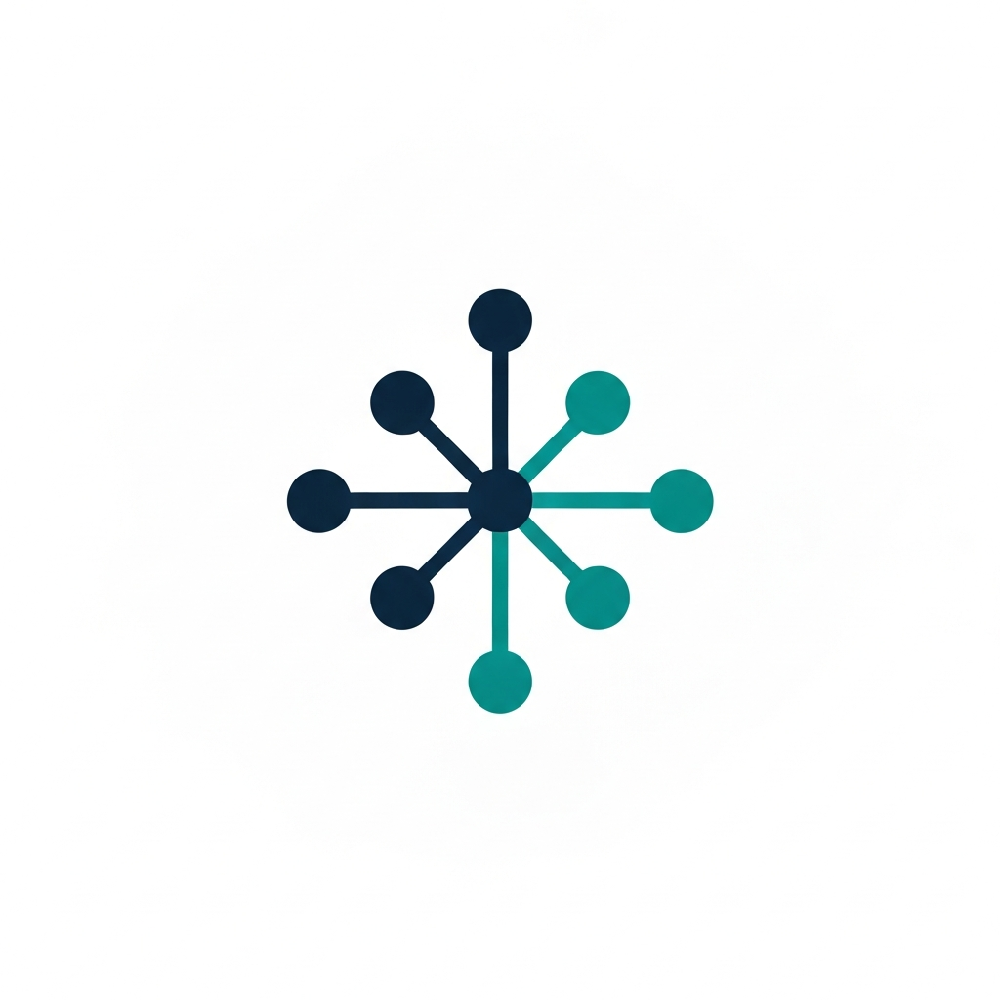

<p align="center">
  
</p>

<h1 align="center">SLM MCP Hub</h1>
<p align="center"><strong>The World's First MCP Gateway That Learns</strong></p>
<p align="center">One hub process. Every MCP server. Every AI client. Shared across sessions.<br/>Federated tool discovery with memory, learning, and cost intelligence.</p>

<p align="center">
  <a href="https://pypi.org/project/slm-mcp-hub/"></a>
  <a href="https://www.npmjs.com/package/slm-mcp-hub"></a>
  <a href="https://www.gnu.org/licenses/agpl-3.0"></a>
  <a href="https://qualixar.com"></a>
</p>

---

## The Problem

Every AI coding session spawns its own MCP server processes. Five Claude Code sessions with 36 MCPs means **180 OS processes eating ~9GB RAM**. Each session loads ~150K tokens of tool definitions into the context window. On a 200K-context model, 75% is gone before you type anything.

And every session starts from zero. No shared cache. No cost tracking. No learning. No coordination between sessions.

## The Solution

SLM MCP Hub runs all your MCPs in **one shared process**. Every AI client connects to one HTTP endpoint. The hub federates, caches, tracks costs, and — with SuperLocalMemory — **learns from every tool call**.

| Metric | Without Hub | With Hub |
|:-------|:-----------|:---------|
| Processes (5 sessions, 36 MCPs) | **180** | **37** (79% reduction) |
| RAM usage | ~9 GB | **~1.9 GB** |
| Session startup | ~30s (spawn 36 processes) | **Instant** (HTTP connect) |
| Tool definitions in context | 400+ tools (~150K tokens) | **3 meta-tools (~1K tokens)** |
| Config management | Per-IDE, per-session | **One hub config** |
| Learning across sessions | None | **Automatic** (with SLM plugin) |

---

## How It Works

### Federated Mode — 3 Tools Instead of 400+

Instead of loading 400+ tool definitions into every session, Claude gets 3 meta-tools:

| Meta-Tool | What It Does |
|:----------|:-------------|
| `hub__search_tools` | Search all tools by name or description. Returns full input schemas. |
| `hub__call_tool` | Call any tool on any MCP server. Routes automatically. |
| `hub__list_servers` | List all connected servers and their tool counts. |

```
You:     "Search GitHub for qualixar repos"
Claude:  hub__search_tools(query="github search")
Hub:     Found: github__search_repositories, github__search_code, ...

Claude:  hub__call_tool(tool="github__search_repositories", arguments={"query": "qualixar"})
Hub:     Routes to GitHub MCP → returns real results
```

**3 tool definitions instead of 400+. That's 150K tokens saved per session.**

---

## Quick Start

```bash
# Install
pip install slm-mcp-hub

# Initialize and import your MCPs
slm-hub config init
slm-hub setup import ~/.claude.json

# Start the hub
slm-hub start
```

### Connect Claude Code

Add to `~/.claude.json`:

```json
{
  "mcpServers": {
    "hub": {
      "type": "http",
      "url": "http://127.0.0.1:52414/mcp"
    }
  }
}
```

Restart Claude Code. All tools available through `hub__search_tools` and `hub__call_tool`.

---

## SLM Plugin — The Gateway That Learns

When [SuperLocalMemory](https://superlocalmemory.com) is running, the hub **automatically** connects to it and learns from every tool call. No configuration needed.

```
SLM MCP Hub v0.1.0 running on http://127.0.0.1:52414/mcp
  MCP servers: 37/37 connected
  Tools: 345
  Plugins: 2 (slm, mesh)         ← Auto-discovered
  SLM: connected (mode=b, 4461 facts)
```

### What the SLM Plugin Does

| Hook | What Happens | SLM Endpoint |
|:-----|:-------------|:-------------|
| **Session start** | Recalls relevant context from past sessions | `POST /api/v3/recall/trace` |
| **Every tool call** | Logs to SLM's learning pipeline — tool name, duration, success/failure | `POST /api/v3/tool-event` |
| **Session end** | Persists session summary for future recall | `POST /api/v3/tool-event` (session_end type) |
| **Warm-up prediction** | Predicts which MCPs you'll need based on recent history | Local ring buffer |

### How It Works Under the Hood

The SLM plugin communicates with the SLM daemon via its HTTP API at `localhost:8765`. No Python import of superlocalmemory required — pure HTTP integration. This means:

- Hub works standalone when SLM is not installed (all hooks are no-ops)
- Hub auto-discovers SLM daemon on startup
- Same SLM daemon serves both the hub plugin AND direct Claude Code hooks
- Every tool call routed through `hub__call_tool` triggers the learning pipeline

### For End Users: SLM Through the Hub

If you use SuperLocalMemory, you can put it inside the hub like any other MCP:

```bash
slm-hub setup import ~/.claude.json   # Imports all MCPs including SLM
slm-hub start                          # SLM runs as a hub backend
```

The SLM plugin replaces the need for separate Claude Code hooks:
- **`on_session_start`** replaces the `session_init` hook
- **`on_tool_call_after`** replaces the `PostToolUse` hook
- **`on_session_end`** replaces the `Stop` hook

Zero manual hook configuration. The hub handles it.

---

## Mesh Plugin — Cross-Session Coordination

When the SLM daemon has mesh enabled, the hub registers as a mesh peer and coordinates across sessions:

| Feature | What It Does |
|:--------|:-------------|
| **Peer registration** | Hub appears on the mesh as an `mcp-hub` agent type |
| **Tool usage broadcast** | Other sessions see which tools are being used |
| **Session notifications** | Mesh peers notified when sessions start/end |
| **Tool list changes** | MCP connect/disconnect events broadcast to mesh |
| **Distributed locking** | Prevent conflicts when multiple sessions access the same resource |

The mesh plugin uses the SLM daemon's mesh HTTP API at `localhost:8765/mesh/*`. Like the SLM plugin, it auto-discovers and is a no-op when mesh is not available.

---

## What Works Today (v0.1.0)

| Feature | Status |
|:--------|:-------|
| Federation — All MCPs behind single endpoint | Working |
| Federated Mode — 3 meta-tools, ~150K token savings | Working |
| Transparent Proxy — `/mcp/{server}`, original tool names | Working |
| SLM Plugin — Tool call learning, session recall, summaries | Working |
| Mesh Plugin — Peer registration, broadcast, distributed locks | Working |
| Intelligent Caching — SHA-256 content-hash, TTL, LRU | Working |
| Cost Tracking — Per-tool costs, session budgets, cascade routing | Working |
| Smart Tool Filtering — Project-type detection, frequency ranking | Working |
| Multi-Client Auto-Setup — Claude Code, VS Code, Cursor, Windsurf, Codex CLI | Working |
| Observability — Per-server metrics, request tracing, audit log | Working |
| Lifecycle Management — Lazy startup, idle shutdown, always-on | Working |
| Permission Model — Per-session role-based rules (ALLOW/DENY/WARN) | Working |
| Resilience — Auto-restart (launchd/systemd), PID management | Working |
| Network Discovery — mDNS/Zeroconf LAN discovery | Working |
| Secrets — `~/.claude-secrets.env` loading, `${VAR}` resolution | Working |
| HTTP + stdio + SSE transport | Working |

---

## Architecture

```
                    ┌───────────────────────────────────────────────┐
                    │             SLM MCP Hub                       │
AI Client 1 ──┐    │                                               │    ┌── GitHub (26 tools)
AI Client 2 ──┼────┤  Federation → Cache → Cost → Route ──────────┼────┤── Gemini (37 tools)
AI Client 3 ──┘    │       ↕           ↕         ↕                │    ├── Context7 (2 tools)
                    │   Permissions  Metrics   Learning            │    ├── SLM (32 tools)
                    │       ↕                     ↕                │    ├── SQLite (8 tools)
                    │  ┌─────────┐          ┌──────────┐           │    └── ...37+ more
                    │  │   SLM   │          │   Mesh   │           │
                    │  │ Plugin  │          │  Plugin  │           │
                    │  └────┬────┘          └────┬─────┘           │
                    └───────┼────────────────────┼─────────────────┘
                            │                    │
                            └────────┬───────────┘
                                     ↓
                           SLM Daemon (localhost:8765)
                           Memory · Learning · Mesh
```

### Plugin Architecture

Plugins are discovered automatically via Python entry_points on hub startup. Each plugin receives lifecycle hooks:

```python
class HubPlugin(ABC):
    async def on_hub_start(self, hub) -> None: ...
    async def on_hub_stop(self) -> None: ...
    async def on_tool_call_after(self, session_id, server, tool, args, result, duration_ms, success) -> None: ...
    async def on_session_start(self, session_id, client_info) -> None: ...
    async def on_session_end(self, session_id) -> None: ...
    async def on_mcp_connect(self, server_name) -> None: ...
    async def on_mcp_disconnect(self, server_name) -> None: ...
```

Built-in plugins:

| Plugin | Connection | What It Adds |
|:-------|:-----------|:-------------|
| `slm` | HTTP → `localhost:8765/api/v3/*` | Memory, learning, session recall, warm-up predictions |
| `mesh` | HTTP → `localhost:8765/mesh/*` | Peer discovery, broadcast, distributed locks |

---

## CLI Reference

```bash
slm-hub start [--port PORT] [--config PATH] [--log-level LEVEL]
slm-hub status
slm-hub config show | init | import <file>
slm-hub setup detect | register | unregister | import
slm-hub network discover | info
```

## Configuration

Hub config: `~/.slm-mcp-hub/config.json`

Environment overrides: `SLM_HUB_PORT`, `SLM_HUB_HOST`, `SLM_HUB_LOG_LEVEL`, `SLM_HUB_CONFIG_DIR`, `SLM_DAEMON_URL`.

Secrets: `~/.claude-secrets.env` (shared with Claude Code). All `${VAR}` placeholders resolve on startup.

---

## Documentation

| Guide | What You'll Learn |
|:------|:-----------------|
| [Getting Started](docs/GETTING-STARTED.md) | Install, import, connect, verify — 5 minutes |
| [Architecture](docs/ARCHITECTURE.md) | Two modes, plugin system, tool call flow |
| [Migration Guide](docs/MIGRATION-GUIDE.md) | Step-by-step from direct MCPs to hub, rollback |
| [Configuration](docs/CONFIGURATION.md) | All settings, API endpoints, CLI reference |

---

## Part of the Qualixar Ecosystem

SLM MCP Hub is the **tool brain** — it manages, routes, and learns from MCP tool calls. It joins the Qualixar suite of AI agent reliability tools:

| Product | What It Does | Install |
|:--------|:-------------|:--------|
| **[SuperLocalMemory](https://superlocalmemory.com)** | Local-first AI agent memory — Fisher-Rao geometry, 5-channel retrieval, zero cloud | `npm install superlocalmemory` |
| **[SLM Mesh](https://github.com/qualixar/slm-mesh)** | Peer-to-peer agent communication — real-time messaging, file locking, shared state | `npm install slm-mesh` |
| **SLM MCP Hub** | Intelligent MCP gateway — federation, caching, cost tracking, learning (this repo) | `pip install slm-mcp-hub` |
| **[Qualixar OS](https://qualixar.com/qualixar-os)** | Universal OS for AI agents — 12 topologies, Forge AI, 24-tab dashboard | `npx qualixar-os` |
| **[AgentAssert](https://agentassert.com)** | Behavioral contracts for AI agents — ContractSpec DSL, drift detection | `pip install agentassert` |
| **[AgentAssay](https://pypi.org/project/agentassay/)** | Token-efficient agent evaluation — 78-100% cost reduction, 10 adapters | `pip install agentassay` |
| **[SkillFortify](https://pypi.org/project/skillfortify/)** | Agent skill security analysis — 100% precision, 22 frameworks, 3 citations | `pip install skillfortify` |

**Together:** SuperLocalMemory (memory brain) + SLM Mesh (connected brain) + SLM MCP Hub (tool brain) = **complete AI intelligence platform**. Each works standalone. Together: unstoppable.

---

## Competitive Landscape

| Tool | Stars | What It Does | What's Missing |
|:-----|:------|:-------------|:---------------|
| **mcp-hub** | 472 | HTTP federation | No memory, no cost tracking, no learning |
| **Supergateway** | 2,573 | Stdio-to-SSE bridge | Broadcasts all responses to all clients |
| **mcpmu** | 87 | Stdio multiplexer | Per-client process spawn, no sharing |
| **mcp-proxy** | 249 | Stdio-to-HTTP | New process per session |
| **SLM MCP Hub** | - | **Federation + memory + learning + cost + mesh** | **The only gateway that learns** |

---

## Author

**Varun Pratap Bhardwaj** · [qualixar.com](https://qualixar.com) · [superlocalmemory.com](https://superlocalmemory.com) · [varunpratap.com](https://varunpratap.com)

7 research papers · 6 open source products · Building the AI Agent Reliability category.

## License

AGPL-3.0-or-later. See [LICENSE](LICENSE).

Commercial licensing: admin@qualixar.com
